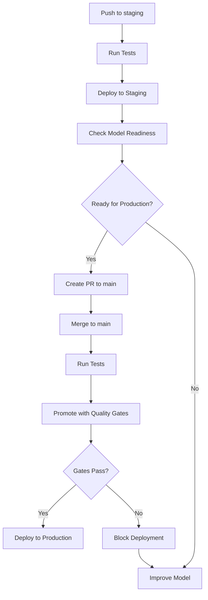

# Model Promotion Scripts

This directory contains scripts for managing MLflow model promotion with quality gates.

## Overview

The model promotion system ensures that only high-quality models are promoted from Staging to Production by implementing automated quality gates and comprehensive logging.

## Scripts

### 1. `promote_with_quality_gate.py`

**Purpose:** Promote models from Staging to Production with quality validation

**Features:**
- ✅ Validates model metrics against quality thresholds
- 📊 Compares Staging vs Production metrics
- 📝 Detailed logging throughout the process
- 🚦 Blocks promotion if quality gates fail
- 📋 Generates CI/CD summary reports

**Usage:**
```bash
export DAGSHUB_REPO="MarcoSrhl/NLP-Fact-checking"
export DAGSHUB_USER="your-username"
export DAGSHUB_TOKEN="your-token"
export MODEL_NAME="fact-checker-gan"  # or fact-checker-bert
export MIN_ACCURACY="0.75"  # Optional, default: 0.75
export MIN_F1_SCORE="0.70"  # Optional, default: 0.70

python scripts/promote_with_quality_gate.py
```

**Quality Gates:**
- **Minimum Accuracy:** 0.75 (75%)
- **Minimum F1 Score:** 0.70 (70%)

Both thresholds must be met for promotion to proceed.

**Output:**
```
================================================================================
🎯 MODEL PROMOTION WITH QUALITY GATES
================================================================================
🔧 MLFLOW SETUP
✅ MLflow tracking configured
🔍 MODEL DISCOVERY
✅ Found Staging model: version 3
📊 Metrics for version 3:
   • test_accuracy: 0.8542
   • test_f1: 0.8321
🚦 QUALITY GATE VALIDATION
✅ Accuracy: 0.8542 (>= 0.75)
✅ F1 Score: 0.8321 (>= 0.70)
⚖️  MODEL COMPARISON
📈 Accuracy: 0.8542 vs 0.8123 (+5.16%)
🎯 Recommended: Model shows improvements in Accuracy
🚀 PROMOTING TO PRODUCTION
✅ PROMOTION SUCCESSFUL
================================================================================
```

### 2. `test_quality_gates.py`

**Purpose:** Test the quality gate validation logic

**Features:**
- 🧪 Unit tests for quality gate validation
- ✅ Tests passing and failing scenarios
- 📊 Tests model comparison logic

**Usage:**
```bash
python scripts/test_quality_gates.py
```

**Test Cases:**
1. ✅ Good metrics pass quality gates
2. ✅ Low accuracy correctly fails
3. ✅ Low F1 correctly fails
4. ✅ Model comparison detects improvements

### 3. Other Legacy Scripts

- `promote_model_to_production.py` - Legacy promotion script (no quality gates)
- `promote_v1_to_staging.py` - One-time script for v1 promotion
- `list_models.py` - List all models in MLflow registry
- `show_model_details.py` - Show detailed model information

## CI/CD Integration

### Staging Pipeline (`.github/workflows/ci-staging.yml`)

**Triggers:** Push to `staging` branch

**Steps:**
1. Run tests
2. Build Docker image
3. Deploy to Fly.io (staging)
4. Smoke tests
5. **Check model promotion readiness** ⬅️ NEW
   - Fetches current Staging model metrics
   - Validates against quality gates
   - Logs readiness status

**Logs Example:**
```
📊 Checking if models in Staging meet quality gates...
📦 Staging Model: fact-checker-gan v3
   Run ID: abc123...
📊 Metrics:
   ✅ Accuracy: 0.8542 (threshold: 0.75)
   ✅ F1 Score: 0.8321 (threshold: 0.70)
✅ Model ready for promotion to Production!
```

### Production Pipeline (`.github/workflows/ci-production.yml`)

**Triggers:** Push to `main` branch

**Steps:**
1. Run tests
2. **Promote GAN model with quality gates** ⬅️ NEW
   - Validates Staging model metrics
   - Compares with current Production
   - Promotes if gates pass
   - Blocks if gates fail
3. **Promote BERT model with quality gates** ⬅️ NEW
4. Build Docker image
5. Deploy to Fly.io (production)
6. Smoke tests

**Quality Gate Success:**
```
🚀 Starting GAN model promotion with quality gates...
✅ Quality gates passed for version 3
⚖️  MODEL COMPARISON
📈 Accuracy: 0.8542 vs 0.8123 (+5.16%)
🎯 Recommended: Model shows improvements in Accuracy
✅ PROMOTION SUCCESSFUL
🎉 Model version 3 is now in Production!
```

**Quality Gate Failure:**
```
🚀 Starting GAN model promotion with quality gates...
❌ Accuracy: 0.6500 (< 0.75)
❌ F1 Score: 0.6200 (< 0.70)
🚫 QUALITY GATE FAILED
   ❌ Accuracy 0.6500 below threshold 0.75
   ❌ F1 Score 0.6200 below threshold 0.70
⛔ Promotion blocked - quality requirements not met
```

### Test Pipeline (`.github/workflows/test.yml`)

**Triggers:** Pull requests to `dev` branch

**Steps:**
1. Run API tests
2. **Test quality gate logic** ⬅️ NEW
   - Validates quality gate validation works
   - Tests edge cases
   - Ensures promotion logic is correct

## Model Stages

```
┌─────────────┐
│   Staging   │ ← New models land here
└──────┬──────┘
       │
       │ Quality Gates Check:
       │ • Accuracy >= 0.75
       │ • F1 Score >= 0.70
       │ • Comparison vs Production
       │
       ↓
┌─────────────┐
│ Production  │ ← Only promoted if gates pass
└──────┬──────┘
       │
       ↓ (when new version promoted)
┌─────────────┐
│  Archived   │ ← Old Production versions
└─────────────┘
```

## Environment Variables

### Required

- `DAGSHUB_REPO` - DagHub repository (e.g., "MarcoSrhl/NLP-Fact-checking")
- `DAGSHUB_USER` - DagHub username
- `DAGSHUB_TOKEN` - DagHub access token
- `MODEL_NAME` - Model name in registry (e.g., "fact-checker-gan")

### Optional

- `MIN_ACCURACY` - Minimum accuracy threshold (default: 0.75)
- `MIN_F1_SCORE` - Minimum F1 score threshold (default: 0.70)
- `GITHUB_STEP_SUMMARY` - GitHub Actions summary file (auto-set in CI)

## Metrics Used

The quality gates check the following metrics from the model's training run:

1. **Accuracy** - Overall prediction accuracy
   - Looks for: `test_accuracy` or `accuracy`
   - Threshold: >= 0.75

2. **F1 Score** - Harmonic mean of precision and recall
   - Looks for: `test_f1`, `f1_score`, or `f1`
   - Threshold: >= 0.70

3. **Additional Info** (not gating):
   - Precision: `test_precision` or `precision`
   - Recall: `test_recall` or `recall`

## Troubleshooting

### Issue: "No model found in Staging"

**Cause:** No model has been registered to the Staging stage

**Solution:** 
1. Train a model and log it to MLflow
2. Register it to the model registry
3. Transition it to Staging stage

### Issue: "Quality gates failed"

**Cause:** Model metrics don't meet minimum thresholds

**Solution:**
1. Review the logged metrics
2. Improve model training/data
3. Re-train and register new model
4. Or adjust thresholds if requirements changed

### Issue: "Could not fetch metrics"

**Cause:** Metrics weren't logged during training run

**Solution:**
1. Ensure training script logs metrics to MLflow
2. Use `mlflow.log_metric()` during training
3. Re-run training with proper metric logging

## GitHub Secrets Configuration

Add these secrets to your GitHub repository:

1. Go to Settings → Secrets and variables → Actions
2. Add the following secrets:
   - `DAGSHUB_REPO` - Your DagHub repository path
   - `DAGSHUB_USER` - Your DagHub username
   - `DAGSHUB_TOKEN` - Your DagHub token (from https://dagshub.com/user/settings/tokens)
   - `NEON_DB_URL` - Database connection string
   - `FLY_API_TOKEN` - Fly.io deployment token

## Best Practices

1. **Always test locally first:**
   ```bash
   python scripts/test_quality_gates.py
   ```

2. **Check staging model before merging to main:**
   - Review GitHub Actions logs in staging pipeline
   - Verify metrics meet quality gates
   - Compare with current production

3. **Monitor promotion logs:**
   - Check "Promote Model to Production" step logs
   - Review quality gate validation results
   - Verify metrics comparison

4. **Adjust thresholds as needed:**
   - Based on business requirements
   - Based on model architecture changes
   - Update in CI workflow files

## Workflow Summary



## Support

For issues or questions:
1. Check GitHub Actions logs
2. Review this documentation
3. Check MLflow/DagHub model registry
4. Contact the ML engineering team
